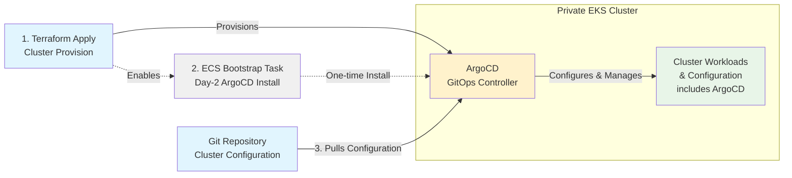

# Design Decision 001: Fully Private EKS Cluster Bootstrap

## Status
**Implemented**

## Scope

This design decision addresses how Management and Regional clusters are provisioned and configured. It does not address what runs the terraform (e.g., HCP Terraform, AWS CodePipeline, Atlantis).

The bootstrap solution must work regardless of terraform runner choice, assuming only that the runner has AWS API access but cannot directly reach private EKS cluster APIs.

## Context

The rosa-regional-platform requires a mechanism to provision and configure secure and private EKS clusters. 

## Alternatives Explored

### Alternative 1: Three-Phase Bootstrap (Public → Private)
**Approach**:
1. Create cluster with public API endpoint + IP whitelist (terraform runner only)
2. Install ArgoCD via terraform/helm
3. Convert cluster to fully private

**Assessment**: Less clean approach, introduces temporary security exposure

### Alternative 2: Fully Private Bootstrap
**Approach**: Create cluster as private, install ArgoCD from within cluster network

**Implementation Options Available**:
- **Node group user data scripts**: Simple but limited observability and error handling
- **Lambda + VPC integration**: Synchronous execution integrates naturally with Terraform workflow, enabling direct log retrieval
- **ECS Fargate container**: External execution model with operational flexibility, provides infrastructure reusability for SRE operations

**Assessment**: Ideal for security. Multiple implementation paths possible with different trade-offs.

### Previously Attempted (Abandoned)
1. **EKS Native Addon**: No native EKS addon exists for ArgoCD
2. **terraform-aws-eks-blueprints-addons**: Wrapper around helm requiring networking path to kube-api from terraform runner
3. **AWS ArgoCD Capability**: Can be enabled via SDK but cannot provide default configuration, requires day-2 kube-api operations

## Decision: ECS Fargate Implementation

**Chosen Approach**: Alternative 2 (Fully Private Bootstrap) implemented via AWS ECS Fargate task execution for an initial argocd configuration allowing the cluster to configure itself. 
**Implementation Rationale**:
- **Infrastructure Reusability**: ECS infrastructure can be reused for future audited SRE operations on private clusters
- **Container-Based Execution**: Rich container environment enables complex bootstrap operations with full tool availability
- **Network Security**: Tasks run in private subnets with controlled EKS API access, ensuring maximum security isolation
- **Observability**: CloudWatch logging provides complete audit trail for all bootstrap operations

## Architecture Overview

## Implementation Design

### EKS Module
Creates fully private EKS cluster with:
- Private VPC with controlled NAT gateway egress
- Managed node groups in private subnets
- Pod Identity for workload authentication
- Managed addons (CoreDNS, VPC-CNI, EBS-CSI)

### Bootstrap System
ECS Fargate-based ArgoCD installation:
- Dedicated ECS infrastructure for secure cluster operations
- Tasks run in private subnets with controlled EKS API access
- Tasks are logged in CloudWatch for observability/auditing

### GitOps Handover
**Application of Applications Pattern**: ArgoCD immediately takes control
- Initial bootstrap creates root ArgoCD application
- Points to git repository for all cluster configuration
- Enables complete self-management via GitOps

### ArgoCD Upgrade Management
**Bootstrap-then-Handoff Pattern**: After initial ECS-based installation, ArgoCD updates itself by pulling its chart version from the self-owning application
- **Safety Measures**:
  - Prune disabled, retry logic, and server-side apply prevent self-deletion
  - Rolling update strategy ensures ArgoCD components remain available during upgrades
  - Failed upgrades maintain existing functionality until manual intervention

## Benefits

**Security & Simplicity**:
- Fully private cluster operation with network isolation
- EKS access entries using modern Kubernetes RBAC integration
- No persistent external dependencies or long-lived infrastructure

**Observability & Operations**:
- CloudWatch logging with complete audit trail for all bootstrap operations
- Real-time log streaming during ECS task execution

**Strategic Alignment**:
- Infrastructure reusability for future audited SRE operations on private clusters
- Standardized ECS pattern for secure, private cluster operations
- Foundation for operational tasks beyond bootstrap (maintenance, monitoring, disaster recovery)

---

**Decision Date**: January 15, 2026
**Decision Maker**: RRP Team