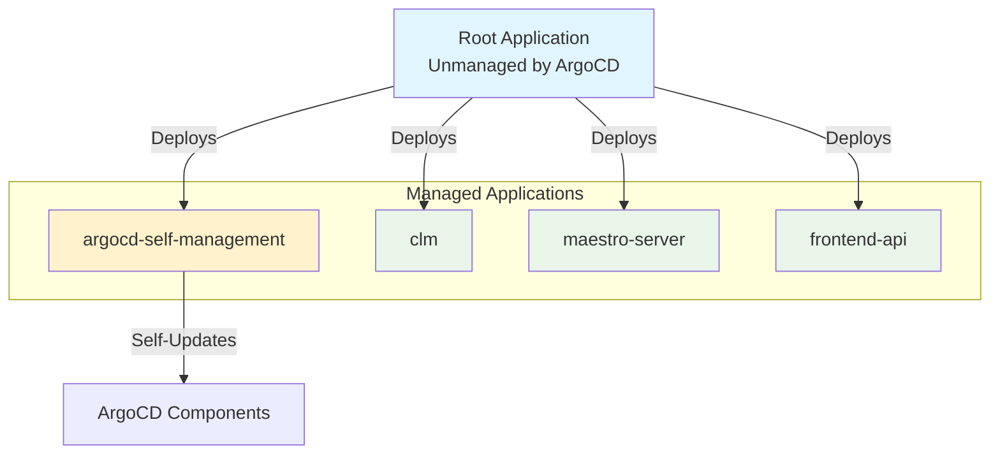

# ArgoCD Setup Documentation

## Overview

ArgoCD provides GitOps-based configuration management for Regional Clusters (RCs) and Management Clusters (MCs) in the ROSA Regional Platform. It manages platform operators and services, not customer ROSA clusters.

### What ArgoCD Manages

**Regional Clusters (RC)**:
- CLM (Cluster Lifecycle Manager)
- Maestro server
- Frontend API services
- Additional platform operators and services as needed

**Management Clusters (MC)**:
- HyperShift operator
- Maestro agent
- Additional platform operators and services as needed

### Key Architecture Concepts

- **Private Bootstrap**: ECS Fargate installs ArgoCD in fully private EKS clusters
- **Unmanaged Root App**: Bootstrap creates root application outside ArgoCD management
- **Self-Management**: ArgoCD manages its own upgrades via GitOps
- **App-of-Apps Pattern**: Root app deploys all cluster configurations from Git

## Bootstrap Process

### Private Cluster Challenge

RRP's fully private EKS clusters cannot be accessed by standard CI/CD systems. The Kubernetes API servers have no public endpoints and no persistent bastion infrastructure.

### ECS Fargate Bootstrap Solution

Bootstrap uses ECS Fargate tasks running inside the private VPC to install ArgoCD:

1. **Infrastructure**: Terraform provisions EKS + ECS bootstrap infrastructure
2. **Trigger**: Bootstrap task is triggered as part of the EKS/ECS setup
3. **Installation**: Fargate task installs kubectl/helm and configures ArgoCD via Helm
4. **Root App Creation**: Creates unmanaged root application pointing to Git repository containing the config for the RC and MC workloads
5. **GitOps Handover**: ArgoCD syncs cluster configuration from `argocd/{cluster-type}/`

## Root Application Strategy

### Unmanaged Root App

The bootstrap process creates a root ArgoCD application that is **NOT managed by ArgoCD itself**:

```yaml
apiVersion: argoproj.io/v1alpha1
kind: Application
metadata:
  name: root
  namespace: argocd
spec:
  source:
    path: argocd/{cluster-type}/      # regional-cluster or management-cluster
    repoURL: {git-repository-url}
    targetRevision: {branch}
  destination:
    server: https://kubernetes.default.svc
    namespace: argocd
  syncPolicy:
    automated:
      prune: false
      selfHeal: true
```

### Why Unmanaged?

The root application is unmanaged primarily for **development flexibility**:

**The Technical Problem**:
1. **Bootstrap creates root app**: Terraform/bootstrap creates the root application with dynamic values (repository URL, branch, cluster-specific paths)
2. **ArgoCD syncs from Git**: When ArgoCD starts, it syncs all applications from the Git repository
3. **Overwrite conflict**: If the root application definition exists in Git, ArgoCD will overwrite the bootstrap-created root app during initial sync
4. **ignoreDifferences doesn't help**: This feature only works after the initial sync completes - it cannot prevent the initial overwrite

**Development vs Production**:
- **Development**: Developers may want to point at their own repository/branch for testing. They would need to ensure their repo's root app configuration exactly matches what terraform provides, or the Git version will override terraform's configuration.
- **Production**: We'll be static with the repository, and bootstrap will always equal the repo configuration, so we could make it managed.

**Current Choice**: Keep it unmanaged for development flexibility, avoiding the need to coordinate repository content with terraform outputs during testing.

## App-of-Apps Pattern

The root application deploys other applications from the `argocd/{cluster-type}/` directory:



1. **Root Application** (`root`): Unmanaged, points to Git repository
2. **Self-Management** (`argocd-self-management.yaml`): Manages ArgoCD itself
3. **Platform Applications**: CLM, Maestro server, Frontend API, etc.

Each application is a standard ArgoCD Application resource in the Git repository.

## Self-Management Pattern

### How It Works

After bootstrap, ArgoCD manages itself via the `argocd-self-management.yaml` application:

```yaml
spec:
  source:
    repoURL: https://argoproj.github.io/argo-helm
    chart: argo-cd
    targetRevision: 9.3.4                         # Chart version
    helm:
      valuesObject:
        redisSecretInit:
          enabled: false                           # Workaround for https://github.com/argoproj/argo-helm/issues/2887
  syncPolicy:
    automated:
      prune: true                                  # Automated resource cleanup
      selfHeal: true                               # Auto drift correction
      allowEmpty: false                            # Safety: prevents catastrophic sync
```

### Key Aspects for Self-Management

- **prune: true**: Automatically removes 'zombie' resources and old configurations deleted from Git
- **allowEmpty: false**: Prevents deletion of existing resources if Git repository becomes empty or unreachable
- **redisSecretInit: false**: Workaround for [known upstream bug](https://github.com/argoproj/argo-helm/issues/2887) to prevent init beyond first helm provision
- **ignoreDifferences**: Ignores helm annotations to prevent warnings and additional reconciliation loops
- **Retry logic**: Exponential backoff for failed sync attempts

### Upgrades

To upgrade ArgoCD:
1. Update `targetRevision` in `argocd-self-management.yaml`
2. Commit and push to Git
3. ArgoCD automatically syncs the new chart version

## Configuration

### Repository Structure

Example structure for a regional cluster:
```
argocd/
├── regional-cluster/              # RC: CLM, Maestro server, APIs
│   ├── argocd-self-management.yaml
│   ├── clm.yaml                  # Cluster Lifecycle Manager
│   ├── maestro-server.yaml       # Maestro Server
│   └── frontend-api.yaml         # Frontend API services
└── management-cluster/            # MC: HyperShift, Maestro agent
    ├── argocd-self-management.yaml
    ├── hypershift-operator.yaml   # HyperShift operator
    └── maestro-agent.yaml         # Maestro agent
```

### Adding Platform Applications

Add new platform operators/services by creating Application YAML files in the appropriate `argocd/{cluster-type}/` directory.

---

**Document Version**: 1.0
**Last Updated**: January 21, 2026